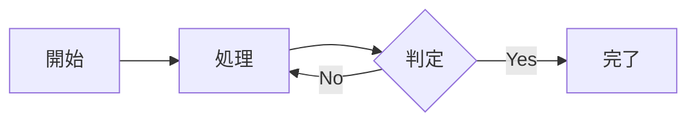

# クイックスタートガイド

DigiOnテーマを使ってプレゼンテーションを素早く作成する方法

## 1. 新しいプレゼンテーションの作成

新規ファイル（例：`my-presentation.md`）を作成し、以下を記述：

```yaml
---
marp: true
style: |
  @import url('https://raw.githubusercontent.com/takasumi-iwamoto-digion/marp-digion-template/main/theme/marp-theme-digion.css');
---

<!-- _class: title -->
<!-- _paginate: false -->

# プレゼンテーションタイトル
サブタイトル

<div class="date">2025年1月15日</div>
<div class="info">資料種別：社内資料</div>
<div class="version">Ver.1.0</div>
<div class="company">株式会社DigiOn</div>
```

## 2. VS Code設定（初回のみ）

VS Codeの設定に以下を追加：

```json
{
  "markdown.marp.themes": ["./theme/marp-theme-digion.css"],
  "markdown.marp.enableHtml": true
}
```

## 3. プレビュー方法

### VS Code

1. ファイルを開く
2. `Ctrl+K V` (Mac: `Cmd+K V`)

### Marp CLI

```bash
marp -s my-presentation.md
```

## 4. 出力方法

```bash
# HTML
marp my-presentation.md

# PDF（画像を含む場合）
marp --allow-local-files --pdf my-presentation.md

# PNG画像（画像を含む場合）
marp --allow-local-files --images png my-presentation.md

# PowerPoint
marp --allow-local-files --pptx my-presentation.md
```

## 5. スライドクラスの使い方

### 通常スライド（デフォルト）

```markdown
---

## スライドタイトル

- 箇条書き項目1
- 箇条書き項目2
- 箇条書き項目3
```

### 見出しスライド

```markdown
---

<!-- _class: headline -->
<!-- _paginate: false -->

## 大見出し
```

### 画像レイアウト

```markdown
---


## 左画像レイアウト

内容
```

### 最終スライド

```markdown
---

<!-- _class: end -->
<!-- _paginate: false -->

<div class="company-info">
  <div class="col1"></div>
  <div class="col2"></div>
  <div class="col3"></div>
  <div class="col4"></div>
  <div class="col5"></div>
</div>
```

### カラムレイアウト

```markdown
---

## 2カラムレイアウト

<div class="columns">
<div>

### 左側

- 内容1
- 内容2

</div>
<div>

### 右側

- 内容A
- 内容B

</div>
</div>
```

利用可能なレイアウト：

- `columns` - 2カラム均等分割
- `columns-3` - 3カラム均等分割
- `columns-40-60` - 40:60の非対称分割
- `columns-60-40` - 60:40の非対称分割

### Mermaid図表
```markdown
---

## フローチャート



## それだけです！

GitHub経由でテーマを読み込んで、すぐに使い始められます。
