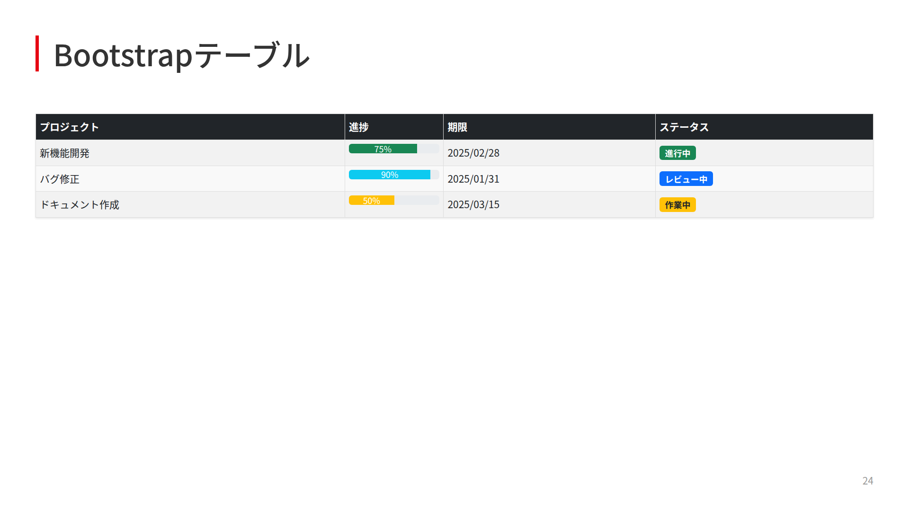

# Marp DigiOn カスタムテーマ

DigiOn向けのMarpプレゼンテーション用カスタムテーマです。

## 概要

このリポジトリには、DigiOnのブランドガイドラインに沿ったMarp用のカスタムCSSテーマが含まれています。タイトルスライド、通常スライド、最終スライドそれぞれに適切なスタイルが定義されています。

## クイックスタート

シンプルな構成で、すぐに使い始められます：

```yaml
---
marp: true
theme: digion
---

# プレゼンテーションタイトル
```

VS Code、Marp CLI、どちらでも同じパスで動作します。

## 特徴

- **タイトルスライド**: DigiOnロゴとCONFIDENTIAL表記を含む
- **通常スライド**: 赤いアクセントカラーを使用した見出し
- **見出しスライド**: 大きなテキストを中央に配置した強調表示
- **画像レイアウト**: 左右に画像を配置可能
- **カラムレイアウト**: 2カラム、3カラム、非対称分割など柔軟な列配置
- **動的グラフ生成**: QuickChart.ioを使用したチャート表示
- **Mermaid図表**: フローチャート、シーケンス図、ガントチャートなど
- **最終スライド**: 会社情報表示用のレイアウト
- **フォント**: Noto Sans JPを使用した読みやすいデザイン

## ファイル構成

```
marp-digion-template/
├── README.md                    # メインドキュメント
├── QUICK_START.md               # クイックスタートガイド
├── theme/                       # テーマ関連ファイル
│   └── marp-theme-digion.css   # カスタムテーマ（FHD: 1920×1080）
├── assets/                      # 静的リソース
│   ├── logo.png                # DigiOnロゴ
│   ├── confidential.png        # CONFIDENTIAL表記
│   ├── bg-headline.jpg         # 見出し背景
│   ├── bg-title.jpg            # タイトル背景
│   └── bg-end.jpg              # 最終スライド背景
├── examples/                    # サンプルプレゼンテーション
│   ├── basic-presentation.md   # 基本サンプル
│   ├── bootstrap-integration.md # Bootstrap統合例
│   └── tailwind-integration.md  # Tailwind統合例
├── docs/                        # 技術ドキュメント
│   ├── column-layouts.md       # カラムレイアウトガイド
│   ├── css-framework-integration.md # CSSフレームワーク統合
│   ├── image-usage-guide.md    # 画像使用ガイド
│   ├── layout-comparison.md    # レイアウト手法比較
│   └── quickchart-usage.md     # QuickChart.io使用ガイド
├── design-specs/                # デザイン仕様
│   ├── template-title.png      # タイトルスライド
│   ├── template-default.png    # 通常スライド
│   ├── template-headline.png   # 見出しスライド
│   ├── template-half-left.png  # 左画像配置
│   ├── template-half-right.png # 右画像配置
│   └── template-last.png       # 最終スライド
├── .marprc.yml                  # Marp設定
├── .vscode/                     # VS Code設定
│   └── settings.json
├── package.json                 # npm設定
└── package-lock.json
```

## VS Code初期設定

### 1. Marp for VS Code拡張機能のインストール

1. VS Codeを開く
2. 拡張機能ビュー（`Ctrl+Shift+X` または `Cmd+Shift+X`）を開く
3. 「Marp for VS Code」を検索
4. インストールボタンをクリック

### 2. カスタムテーマの登録

VS Codeの設定（`Ctrl+,` または `Cmd+,`）を開き、以下を追加：

```json
{
  "markdown.marp.themes": [
    "./theme/marp-theme-digion.css"
  ],
  "markdown.marp.enableHtml": true
}
```

### 3. プレビューの使い方

- **プレビューを開く**: `Ctrl+K V` または `Cmd+K V`
- **サイドバイサイドプレビュー**: `Ctrl+K Ctrl+V` または `Cmd+K Cmd+V`

プレビューウィンドウではリアルタイムでスライドの見た目を確認できます。

## 使用方法

### 1. テーマの適用

```yaml
---
marp: true
style: |
  @import url('https://raw.githubusercontent.com/takasumi-iwamoto-digion/marp-digion-template/main/theme/marp-theme-digion.css');
---
```

**注意**: テーマ名は内部的に`digion`として定義されています。

### 2. スライドクラスの使用

#### タイトルスライド

```markdown
<!-- _class: title -->
<!-- _paginate: false -->

# プレゼンテーションタイトル
サブタイトル

<div class="date">2025年1月15日</div>
<div class="info">資料種別：社内資料</div>
<div class="version">Ver.1.0</div>
<div class="company">株式会社DigiOn</div>
```

#### 通常スライド

```markdown
## スライドタイトル

- 箇条書き項目1
- 箇条書き項目2
- 箇条書き項目3
```

#### 見出しスライド（headline）

```markdown
<!-- _class: headline -->
<!-- _paginate: false -->

## 大見出し
```

#### 画像レイアウト

左側に画像：
```markdown


## タイトル
内容
```

右側に画像：
```markdown


## タイトル
内容
```

#### 最終スライド

```markdown
<!-- _class: end -->
<!-- _paginate: false -->

<div class="company-info">
  <div class="col1"></div>
  <div class="col2"></div>
  <div class="col3"></div>
  <div class="col4"></div>
  <div class="col5"></div>
</div>
```

※ 会社情報のテキストはすべてCSSで自動的に表示されます

#### コードブロック

通常のMarkdownのコードブロックがそのまま使用できます：

````markdown
```javascript
const digion = new DigiOnSDK({
  apiKey: 'your-api-key',
  platform: 'web'
});
```
````

#### テーブル

通常のMarkdownテーブルが装飾付きで表示されます：

```markdown
| 製品名 | 対応OS | 主な機能 |
|--------|--------|----------|
| DigiOn Video | Windows/Mac/Linux | 動画再生・編集 |
| DigiOn Audio | iOS/Android | 音声処理・変換 |
```

#### カラムレイアウト

コンテンツを複数列に分割して表示できます：

2カラム（均等分割）：
```markdown
<div class="columns">
<div>

### 左側のコンテンツ
- 項目1
- 項目2

</div>
<div>

### 右側のコンテンツ
- 項目A
- 項目B

</div>
</div>
```

3カラム：
```markdown
<div class="columns-3">
<div>

### 第1カラム
内容1

</div>
<div>

### 第2カラム
内容2

</div>
<div>

### 第3カラム
内容3

</div>
</div>
```

非対称レイアウト（40:60）：
```markdown
<div class="columns-40-60">
<div>狭い方（40%）</div>
<div>広い方（60%）</div>
</div>
```

利用可能なクラス：
- `columns` - 2カラム均等分割
- `columns-3` - 3カラム均等分割
- `columns-40-60` - 40:60の非対称分割
- `columns-60-40` - 60:40の非対称分割
- `flex-columns` - Flexboxによる柔軟な分割
- `rows` - 垂直2分割
- `twocols` / `threecols` - column-countによるテキスト自動流し込み

#### グラフ表示

QuickChart.ioを使用して動的にグラフを生成できます：

```markdown

```

詳細は[QuickChart使用ガイド](docs/quickchart-usage.md)を参照してください。

## Bootstrap統合

本テーマはBootstrap 5.3.0と完全に統合されており、Bootstrapのコンポーネントを活用できます。

### 有効化方法

マークダウンのフロントマターで`html: true`を設定してください：

```yaml
---
marp: true
theme: digion
html: true
---
```

### 統合例

#### アラートとバッジ


Bootstrapのアラートコンポーネントとバッジを使用した情報表示の例です。

#### テーブルスタイル


Bootstrapのテーブルクラスを使用した、美しいデータ表示の例です。

#### カードコンポーネント


Bootstrapのカードコンポーネントを使用したコンテンツのグループ化の例です。

### 使用方法

```html
<!-- アラート -->
<div class="alert alert-success">成功メッセージ</div>

<!-- バッジ -->
<span class="badge bg-primary">新着</span>

<!-- ボタン -->
<button class="btn btn-primary">送信</button>

<!-- カード -->
<div class="card">
  <div class="card-body">
    <h5 class="card-title">タイトル</h5>
    <p class="card-text">内容</p>
  </div>
</div>
```

詳細な統合方法については [docs/css-framework-integration.md](docs/css-framework-integration.md) を参照してください。

## Mermaid図表

本テーマではMermaidを使用した様々な図表の作成が可能です。

### サポートされる図表タイプ

- **フローチャート**: プロセスフローや意思決定フローの表現
- **シーケンス図**: システム間のメッセージングを表現
- **ガントチャート**: プロジェクトスケジュールの管理
- **クラス図**: オブジェクト指向設計の表現
- **状態遷移図**: ステートマシンの可視化
- **円グラフ**: 構成比や割合の表示

### 使用例

```markdown


より詳細な例は `examples/basic-presentation.md` の「Mermaid図表」セクションを参照してください。

## 生成例

`basic-presentation.md`から生成されたスライドの例：

### タイトルスライド


### 通常スライド（特徴説明）


### 見出しスライド（headline）


### 画像レイアウト（左側）


### コードブロック


### テーブル


### 最終スライド


## デザイン目標

`target/`ディレクトリには、このテーマが目指すデザインのテンプレート画像が含まれています：

- **DigiOn-Template-title.png**: タイトルスライドのデザイン
- **DigiOn-Template-default.png**: 通常スライドのレイアウト
- **DigiOn-Template-headline.png**: 見出しスライドのスタイル
- **DigiOn-Template-half-left.png**: 左側に画像を配置したレイアウト
- **DigiOn-Template-half-right.png**: 右側に画像を配置したレイアウト
- **DigiOn-Template-last.png**: 最終スライドのデザイン

これらの画像を参考に、CSSテーマが作成されています。

## カスタマイズ

CSSファイルを編集することで、以下の要素をカスタマイズできます：

- **カラーテーマ**: アクセントカラー（デフォルト: #E60012）
- **フォントサイズ**: 見出しや本文のサイズ
- **余白**: スライドのパディングやマージン
- **背景画像**: 各スライドタイプの背景

## 注意事項

- **Marp CLIを使用する場合、`.marprc.yml`にテーマが設定されているため、特別なオプションは不要です**
  ```bash
  # プレビュー
  marp -s basic-presentation.md
  
  # PDF出力
  marp --pdf basic-presentation.md
  ```
- **画像を含むPDF/PNG出力時は `--allow-local-files` オプションが必要です**
  ```bash
  marp --allow-local-files --pdf basic-presentation.md
  marp --allow-local-files --images png basic-presentation.md
  ```
- GitHub版を使用する場合は、インターネット接続が必要です
- CONFIDENTIALマークが含まれているため、社外への公開時は注意してください

## ライセンス

社内利用限定