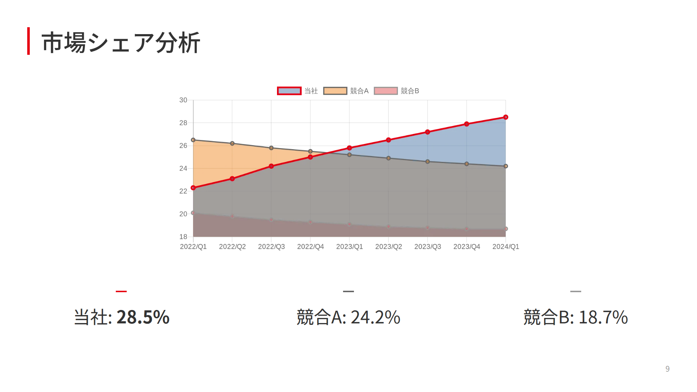
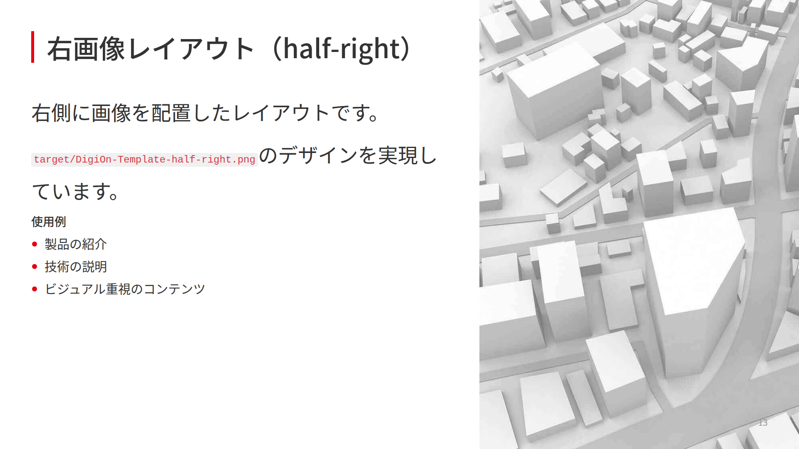
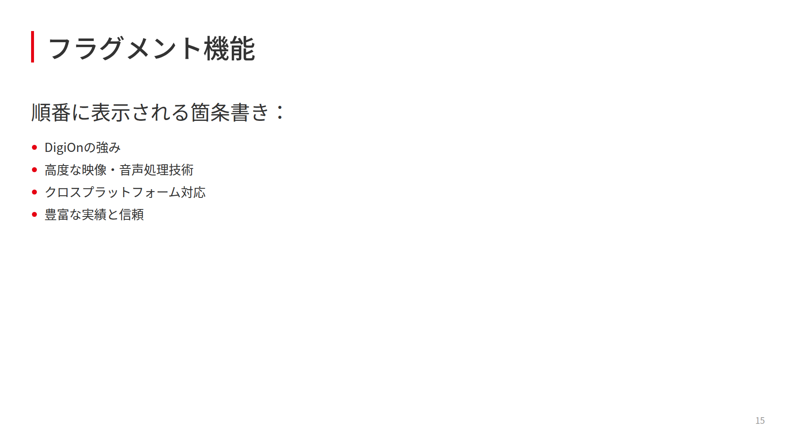

# Marp DigiOn カスタムテーマ

DigiOn向けのMarpプレゼンテーション用カスタムテーマです。

## 概要

このリポジトリには、DigiOnのブランドガイドラインに沿ったMarp用のカスタムCSSテーマが含まれています。タイトルスライド、通常スライド、最終スライドそれぞれに適切なスタイルが定義されています。

## クイックスタート

シンプルな構成で、すぐに使い始められます：

```yaml
---
marp: true
theme: digion
---

# プレゼンテーションタイトル
```

VS Code、Marp CLI、どちらでも同じパスで動作します。

## 特徴

- **タイトルスライド**: DigiOnロゴとCONFIDENTIAL表記を含む
- **通常スライド**: 赤いアクセントカラーを使用した見出し
- **見出しスライド**: 大きなテキストを中央に配置した強調表示
- **画像レイアウト**: 左右に画像を配置可能
- **最終スライド**: 会社情報表示用のレイアウト
- **フォント**: Noto Sans JPを使用した読みやすいデザイン

## ファイル構成

```
marp-digion-template/
├── marp-theme-digion.css        # カスタムテーマ（HD: 1280×720）
├── basic-presentation.md        # 基本的な使用例（高度なレイアウト例を含む）
├── images/                      # 画像ディレクトリ
│   ├── image1.png              # DigiOnロゴ
│   ├── image2.png              # CONFIDENTIAL表記
│   ├── image3.jpg              # 背景画像
│   ├── image4.jpg              # タイトルスライド背景
│   └── image5.jpg              # 最終スライド背景
├── docs/                        # ドキュメント
│   ├── github-hosting-guide.md
│   ├── vscode-setup-guide.md
│   └── ...
├── target/                      # デザイン目標となるテンプレート画像
│   ├── DigiOn-Template-title.png      # タイトルスライド
│   ├── DigiOn-Template-default.png    # 通常スライド
│   ├── DigiOn-Template-headline.png   # 見出しスライド
│   ├── DigiOn-Template-half-left.png  # 左画像配置
│   ├── DigiOn-Template-half-right.png # 右画像配置
│   └── DigiOn-Template-last.png       # 最終スライド
├── examples/                    # 生成されたスライドの例
│   ├── basic-presentation.001.png     # タイトルスライド
│   ├── basic-presentation.002.png     # 通常スライド（特徴説明）
│   ├── basic-presentation.009.png     # 見出しスライド
│   ├── basic-presentation.010.png     # 左画像レイアウト
│   ├── basic-presentation.013.png     # コードブロック
│   ├── basic-presentation.014.png     # テーブル
│   ├── basic-presentation.015.png     # 最終スライド
│   └── ...                            # その他のスライド
├── QUICK_START.md               # クイックスタートガイド
└── README.md                    # このファイル
```

## VS Code初期設定

### 1. Marp for VS Code拡張機能のインストール

1. VS Codeを開く
2. 拡張機能ビュー（`Ctrl+Shift+X` または `Cmd+Shift+X`）を開く
3. 「Marp for VS Code」を検索
4. インストールボタンをクリック

### 2. カスタムテーマの登録

VS Codeの設定（`Ctrl+,` または `Cmd+,`）を開き、以下を追加：

```json
{
  "markdown.marp.themes": [
    "./marp-theme-digion.css"
  ],
  "markdown.marp.enableHtml": true
}
```

### 3. プレビューの使い方

- **プレビューを開く**: `Ctrl+K V` または `Cmd+K V`
- **サイドバイサイドプレビュー**: `Ctrl+K Ctrl+V` または `Cmd+K Cmd+V`

プレビューウィンドウではリアルタイムでスライドの見た目を確認できます。

## 使用方法

### 1. テーマの適用

#### 方法A: ローカル版（開発・オフライン用）

```yaml
---
marp: true
theme: digion
---
```

#### 方法B: GitHub経由（配布・共有用）

```yaml
---
marp: true
style: |
  @import url('https://raw.githubusercontent.com/takasumi-iwamoto-digion/marp-digion-template/main/marp-theme-digion.css');
---
```

**注意**: GitHub経由版でも、テーマ名は内部的に`digion`として定義されています。

### 2. スライドクラスの使用

#### タイトルスライド

```markdown
<!-- _class: title -->
<!-- _paginate: false -->

# プレゼンテーションタイトル
サブタイトル

<div class="date">2025年1月15日</div>
<div class="info">資料種別：社内資料</div>
<div class="version">Ver.1.0</div>
<div class="company">株式会社DigiOn</div>
```

#### 通常スライド

```markdown
## スライドタイトル

- 箇条書き項目1
- 箇条書き項目2
- 箇条書き項目3
```

#### 見出しスライド（headline）

```markdown
<!-- _class: headline -->
<!-- _paginate: false -->

## 大見出し
```

#### 画像レイアウト

左側に画像：
```markdown


## タイトル
内容
```

右側に画像：
```markdown


## タイトル
内容
```

#### 最終スライド

```markdown
<!-- _class: end -->
<!-- _paginate: false -->

<div class="company-info">
  <div class="col1"></div>
  <div class="col2"></div>
  <div class="col3"></div>
  <div class="col4"></div>
  <div class="col5"></div>
</div>
```

※ 会社情報のテキストはすべてCSSで自動的に表示されます

#### コードブロック

通常のMarkdownのコードブロックがそのまま使用できます：

````markdown
```javascript
const digion = new DigiOnSDK({
  apiKey: 'your-api-key',
  platform: 'web'
});
```
````

#### テーブル

通常のMarkdownテーブルが装飾付きで表示されます：

```markdown
| 製品名 | 対応OS | 主な機能 |
|--------|--------|----------|
| DigiOn Video | Windows/Mac/Linux | 動画再生・編集 |
| DigiOn Audio | iOS/Android | 音声処理・変換 |
```

## 生成例

`basic-presentation.md`から生成されたスライドの例：

### タイトルスライド


### 通常スライド（特徴説明）


### 見出しスライド（headline）


### 画像レイアウト（左側）


### コードブロック


### テーブル


### 最終スライド


## デザイン目標

`target/`ディレクトリには、このテーマが目指すデザインのテンプレート画像が含まれています：

- **DigiOn-Template-title.png**: タイトルスライドのデザイン
- **DigiOn-Template-default.png**: 通常スライドのレイアウト
- **DigiOn-Template-headline.png**: 見出しスライドのスタイル
- **DigiOn-Template-half-left.png**: 左側に画像を配置したレイアウト
- **DigiOn-Template-half-right.png**: 右側に画像を配置したレイアウト
- **DigiOn-Template-last.png**: 最終スライドのデザイン

これらの画像を参考に、CSSテーマが作成されています。

## カスタマイズ

CSSファイルを編集することで、以下の要素をカスタマイズできます：

- **カラーテーマ**: アクセントカラー（デフォルト: #E60012）
- **フォントサイズ**: 見出しや本文のサイズ
- **余白**: スライドのパディングやマージン
- **背景画像**: 各スライドタイプの背景

## 注意事項

- **Marp CLIを使用する場合は `--theme marp-theme-digion.css` オプションが必要です**
  ```bash
  # プレビュー
  marp -s --theme marp-theme-digion.css basic-presentation.md
  
  # PDF出力
  marp --theme marp-theme-digion.css --pdf basic-presentation.md
  ```
- ローカル版では画像ファイルは`images/`ディレクトリから参照されます
- **画像を含むPDF/PNG出力時は `--allow-local-files` オプションが必要です**
  ```bash
  marp --theme marp-theme-digion.css --allow-local-files --pdf basic-presentation.md
  marp --theme marp-theme-digion.css --allow-local-files --images png basic-presentation.md
  ```
- GitHub版を使用する場合は、インターネット接続が必要です
- CONFIDENTIALマークが含まれているため、社外への公開時は注意してください

## ライセンス

社内利用限定