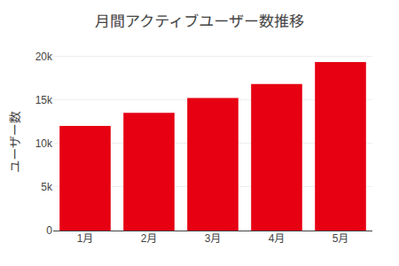
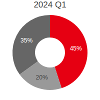
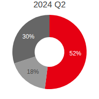
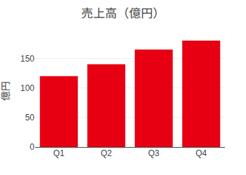
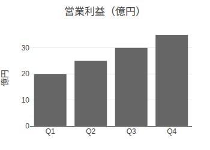
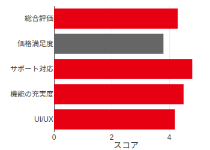
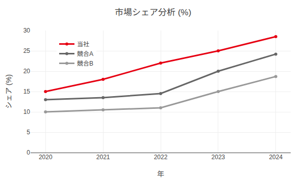

<!-- _class: title -->
<!-- _paginate: false -->


# DigiOn プレゼンテーション
基本から高度なレイアウトまで対応したMarpテンプレート

<div class="date">2025年1月15日</div>
<div class="info">資料種別：デモ資料</div>
<div class="version">Ver.1.0</div>
<div class="company">株式会社DigiOn</div>

---

## DigiOnテーマの特徴

プロフェッショナルなプレゼンテーションを簡単に作成：

- **豊富なレイアウト**: タイトル、通常、見出し、画像配置など多彩なスライドタイプ
- **統一されたデザイン**: DigiOnブランドカラーとフォントで一貫性のある見た目
- **簡単な使い方**: `theme: digion` を指定するだけですぐに利用可能
- **柔軟なカスタマイズ**: コードブロック、テーブル、グラフなど様々なコンテンツに対応

---

## 月間アクティブユーザー数推移

<div style="display: flex; align-items: center; gap: 40px;">
  <div style="flex: 1;">
    
  </div>
  <div style="flex: 1;">
    <ul style="font-size: 20px;">
      <li><strong>前月比15%増加</strong></li>
      <li>新機能リリースの効果が顕著</li>
      <li>特に20-30代の利用が活発化</li>
      <li>継続率も5ポイント改善</li>
    </ul>
  </div>
</div>

---

## 売上構成比の変化

<div style="display: flex; flex-direction: column; gap: 20px;">
  <div style="text-align: center;">
    <div style="display: flex; justify-content: center; gap: 40px; margin: 20px 0;">
      <div>
        
      </div>
      <div>
        
      </div>
    </div>
  </div>
  <div style="display: flex; justify-content: space-around; font-size: 18px;">
    <div>
      <div style="display: inline-block; width: 15px; height: 15px; background: #E60012; margin-right: 5px;"></div>
      <strong>プロダクトA</strong><br>
      45% → 52% (+7pt)
    </div>
    <div>
      <div style="display: inline-block; width: 15px; height: 15px; background: #666; margin-right: 5px;"></div>
      <strong>プロダクトB</strong><br>
      35% → 30% (-5pt)
    </div>
    <div>
      <div style="display: inline-block; width: 15px; height: 15px; background: #999; margin-right: 5px;"></div>
      <strong>プロダクトC</strong><br>
      20% → 18% (-2pt)
    </div>
  </div>
</div>

---

## 四半期業績サマリー

<div style="display: grid; grid-template-columns: 1fr 1fr; gap: 30px;">
  <div>
    <h3 style="font-size: 24px; color: #E60012;">売上高（億円）</h3>
    
    <p style="font-size: 16px; margin-top: 10px;">前年同期比 <strong>+23%</strong></p>
  </div>
  <div>
    <h3 style="font-size: 24px; color: #E60012;">営業利益（億円）</h3>
    
    <p style="font-size: 16px; margin-top: 10px;">前年同期比 <strong>+35%</strong></p>
  </div>
</div>

---

## ユーザー満足度調査結果

<div style="display: flex; gap: 30px; align-items: flex-start;">
  <div style="flex: 1.5;">
    
  </div>
  <div style="flex: 1; background-color: #f8f8f8; padding: 20px; border-radius: 8px;">
    <h3 style="font-size: 20px; margin-top: 0;">主な改善ポイント</h3>
    <ul style="font-size: 16px; line-height: 1.8;">
      <li>レスポンスタイムの改善</li>
      <li>新機能のチュートリアル充実</li>
      <li>カスタマーサポート体制強化</li>
    </ul>
    <p style="font-size: 14px; color: #666; margin-top: 15px;">
      ※ n=1,234 / 調査期間: 2024年12月
    </p>
  </div>
</div>

---

## 市場シェア分析

<div style="text-align: center;">
  
  
  <div style="display: flex; justify-content: center; gap: 40px; font-size: 18px; margin-top: 20px;">
    <div style="display: flex; align-items: center; gap: 10px;">
      <div style="width: 20px; height: 3px; background-color: #E60012;"></div>
      <span>当社: <strong>28.5%</strong></span>
    </div>
    <div style="display: flex; align-items: center; gap: 10px;">
      <div style="width: 20px; height: 3px; background-color: #666;"></div>
      <span>競合A: 24.2%</span>
    </div>
    <div style="display: flex; align-items: center; gap: 10px;">
      <div style="width: 20px; height: 3px; background-color: #999;"></div>
      <span>競合B: 18.7%</span>
    </div>
  </div>
</div>

---

## 通常のスライド（default）

これは通常のスライドレイアウトです。`target/DigiOn-Template-default.png`のデザインを再現しています。

- 赤いアクセントカラーの見出し
- 標準的な箇条書きスタイル
- ページ番号の表示

---

<!-- _class: headline -->
<!-- _paginate: false -->

## 大見出し

---


## 左画像レイアウト（half-left）

左側に画像を配置したレイアウトです。

`target/DigiOn-Template-half-left.png`のデザインを実現しています。

- 画像とテキストのバランス
- 視覚的な説明に最適
- コンテンツエリアは右側に集約

---


## 右画像レイアウト（half-right）

右側に画像を配置したレイアウトです。

`target/DigiOn-Template-half-right.png`のデザインを実現しています。

### 使用例
- 製品の紹介
- 技術の説明
- ビジュアル重視のコンテンツ

---

## フラグメント機能

順番に表示される箇条書き：

* DigiOnの強み
* 高度な映像・音声処理技術
* クロスプラットフォーム対応
* 豊富な実績と信頼

---

## コードブロックの例

```javascript
// DigiOn SDK の使用例
const digion = new DigiOnSDK({
  apiKey: 'your-api-key',
  platform: 'web'
});

digion.initialize().then(() => {
  console.log('DigiOn SDK initialized');
});
```

---

## テーブルレイアウト

| 製品名 | 対応OS | 主な機能 |
|--------|--------|----------|
| DigiOn Video | Windows/Mac/Linux | 動画再生・編集 |
| DigiOn Audio | iOS/Android | 音声処理・変換 |
| DigiOn Stream | Web | ストリーミング配信 |

---


<!-- _class: end -->
<!-- _paginate: false -->

<div class="company-info">
  <div class="col1"></div>
  <div class="col2"></div>
  <div class="col3"></div>
  <div class="col4"></div>
  <div class="col5"></div>
</div>